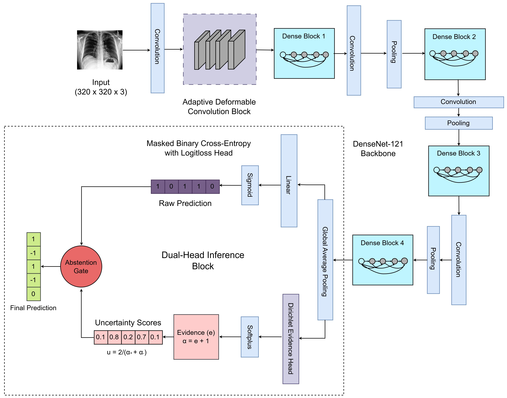

# AdURA-Net: Adaptive Uncertainty and Region-Aware Network

> **AdURA-Net** is a geometry-driven, adaptive uncertainty-aware framework for reliable thoracic disease classification from chest X-rays. It combines adaptive deformable convolutions with a DenseNet backbone and a dual-head loss (masked BCE + Dirichlet evidential learning) to enable principled three-way prediction: **positive**, **negative**, or **uncertain**.

[Paper (PDF)](https://arxiv.org/abs/2603.00201) | Dataset: [CheXpert-Small](https://stanfordmlgroup.github.io/competitions/chexpert/)

---

## Key Features

- **Adaptive Deformable Convolution Block** — geometry-aware early feature refinement capturing anatomical structures
- **Dual-Head Prediction** — simultaneous BCE classification head and Dirichlet evidential uncertainty head
- **Principled Abstention** — model outputs `-1` (uncertain) when accumulated evidence is below threshold (τ = 0.4), avoiding overconfident predictions on ambiguous or OOD samples
- **Single Forward Pass Inference** — no Monte Carlo sampling required
- **Multi-scale DenseNet Backbone** — evaluated with DenseNet-121, DenseNet-161, and DenseNet-201

---

## Repository Structure

```
AdURA-NET/
└── Adaptive_Deformable_Densenet121/
    ├── __pycache__/
    ├── logs/
    ├── trained_models/                    # Saved model checkpoints (.pth)
    │   ├── adcb_dense121_u_one.pth
    │   ├── adcb_dense161_u_one.pth
    │   └── adcb_dense201_u_one.pth
    ├── densenet.py                        # DenseNet backbone definition
    ├── adcb_dense_u_one.py                # Main model: ADCB + DenseNet + dual-head (U-One)
    ├── adcb_dense_u_one_161.py            # Variant with DenseNet-161
    ├── adcb_dense_u_one_201.py            # Variant with DenseNet-201
    ├── adcb_dense_u_zero.py               # Variant using U-Zero label strategy
    ├── chexpert_preprocess.py             # Base CheXpert preprocessing utilities
    ├── chexpert_preprocess_u_one.py       # Preprocessing for U-One label strategy
    ├── chexpert_preprocess_u_zero.py      # Preprocessing for U-Zero label strategy
    ├── chexpert_preprocess_5labels.py     # Preprocessing for 5-disease task
    ├── chexpert_preprocess_14labels.py    # Preprocessing for 13/14-disease task
    └── ensemble_14.ipynb                  # Ensemble inference notebook (13-disease task)
```

---

## Environment Setup

### Requirements

| Dependency   | Version       |
|--------------|---------------|
| Python       | ≥ 3.9         |
| PyTorch      | ≥ 2.0.0       |
| CUDA         | 11.8 / 12.1   |
| torchvision  | ≥ 0.15.0      |
| numpy        | ≥ 1.23        |
| pandas       | ≥ 1.5         |
| scikit-learn | ≥ 1.2         |
| matplotlib   | ≥ 3.6         |
| tqdm         | ≥ 4.64        |
| Pillow       | ≥ 9.0         |

### Install via pip

```bash
pip install torch torchvision --index-url https://download.pytorch.org/whl/cu118
pip install numpy pandas scikit-learn matplotlib tqdm Pillow
```

### Install via conda

```bash
conda create -n adura python=3.10
conda activate adura
conda install pytorch torchvision pytorch-cuda=11.8 -c pytorch -c nvidia
pip install pandas scikit-learn matplotlib tqdm Pillow
```

### Verify CUDA

```python
import torch
print(torch.__version__)          # e.g. 2.0.1+cu118
print(torch.cuda.is_available())  # True
print(torch.cuda.get_device_name(0))
```

---

## Dataset

**CheXpert-Small** — Stanford ML Group

- 14 thoracic pathology labels: `{1: positive, 0: negative, -1: uncertain}`
- This work evaluates on **5-disease** and **13-disease** subsets (excluding "No Finding")
- Dataset split: **96% train / 4% validation** (custom split to preserve uncertainty labels)

### Download

```bash
# Register and download from:
# https://www.kaggle.com/datasets/ashery/chexpert
# Then place files as:
data/
└── CheXpert-v1.0-small/
    ├── train/
    ├── valid/
    ├── train.csv
    └── valid.csv
```

### Label Strategy

| Strategy   | Uncertain label (−1) treated as                  |
|------------|--------------------------------------------------|
| `U-Zero`   | Negative (0)                                     |
| `U-One`    | Positive (1)                                     |
| `U-Ignore` | Masked / ignored during training                 |
| **Ours**   | Retained as explicit `-1` class (uncertainty-aware) |

---

## Training

### 5-Disease Classification (U-One, DenseNet-121)

```bash
python adcb_dense_u_one.py
```

### 5-Disease Classification (U-Zero, DenseNet-121)

```bash
python adcb_dense_u_zero.py
```

### With DenseNet-161 or DenseNet-201

```bash
python adcb_dense_u_one_161.py   # DenseNet-161
python adcb_dense_u_one_201.py   # DenseNet-201
```

### Key Hyperparameters

| Parameter           | Value                            |
|---------------------|----------------------------------|
| Optimizer           | AdamW (β₁=0.9, β₂=0.999)        |
| Learning Rate       | 3 × 10⁻⁴                         |
| Weight Decay        | 1 × 10⁻⁵                         |
| Batch Size          | 16                               |
| LR Schedule         | Cosine Annealing (T_max=100)     |
| λ_Dir (evidential)  | 0.2                              |
| λ_orth              | 5 × 10⁻³                         |
| Huber δ             | 1.0                              |
| Abstention τ        | 0.4                              |
| Image Size          | 320 × 320                        |
| Backbone Init       | Random (no ImageNet pretraining) |

---

## Results

### 5-Disease Task (Cardiomegaly, Edema, Consolidation, Atelectasis, Pleural Effusion)

| Backbone     | Micro-AUC  | Uncertainty Recall | Selective Accuracy |
|--------------|------------|--------------------|--------------------|
| DenseNet-121 | **0.9334** | **0.4675**         | **0.9528**         |
| DenseNet-161 | 0.9315     | 0.4582             | 0.9298             |
| DenseNet-201 | 0.9348     | 0.4387             | 0.9315             |

### 13-Disease Task

| Backbone     | Micro-AUC  | Uncertainty Recall | Selective Accuracy |
|--------------|------------|--------------------|--------------------|
| DenseNet-121 | **0.9318** | **0.4245**         | **0.9365**         |
| DenseNet-161 | 0.9140     | 0.4021             | 0.9320             |
| DenseNet-201 | 0.9267     | 0.4130             | 0.9310             |

> **Selective Accuracy**: Accuracy computed only over samples where the model issues a confident (non-abstained) prediction.  
> **Uncertainty Recall**: Fraction of ground-truth uncertain samples correctly identified as uncertain.

---

## Ensemble Inference (13-Disease)

```bash
jupyter notebook ensemble_14.ipynb
```

The ensemble averages logits from DenseNet-121, DenseNet-161, and DenseNet-201 for improved performance on heterogeneous disease categories (mean AUC: 0.8402).

---

## Model Architecture Overview

<div align="center">
  
  <br/>
  <em>Overview of the proposed AdURA-Net architecture. 
        The Adaptive Deformable Convolution Block enhances early geometric feature extraction. DenseNet-121 serves as the backbone for hierarchical feature propagation. A dual-head prediction module produces (1) class probabilities via a sigmoid classifier, and (2) Dirichlet Evidence $(e_i)$ for uncertainty quantification. The network is trained jointly using BCE (masked) loss, Dirichlet evidential loss, offset loss, and orthogonal regularization. During inference, the BCE head outputs the raw prediction, and the Dirichlet head outputs evidence that is used for uncertainty calculations. The abstention gate checks the uncertainty values $(u_i)$. If it is greater than the threshold $(\tau = 0.4)$, then it replaces it with $(-1)$; otherwise, it is retained.</em>
</div>

### Loss Function

```
L = L_BCE + λ_Dir · L_Dir + L_offset + λ_orth · L_orth
```

| Component   | Purpose                                                       |
|-------------|---------------------------------------------------------------|
| `L_BCE`     | Masked binary cross-entropy (uncertain labels excluded)       |
| `L_Dir`     | Dirichlet evidential loss (uncertainty-aware supervision)     |
| `L_offset`  | Huber loss on deformable offsets (geometric stability)        |
| `L_orth`    | Orthogonal regularization (feature decoupling)                |

---

## Citation

If you use this work, please cite:

```bibtex
@inproceedings{aichroy2025aduranet,
  title       = {AdURA-Net: Adaptive Uncertainty and Region-Aware Network},
  author      = {Aich Roy, Antik and Bhattacharya, Ujjwal},
  institution = {Indian Statistical Institute, Kolkata},
  year        = {2025}
}
```

---

## Contact

- **Antik Aich Roy** — antikaichroy_t@isical.ac.in
- **Ujjwal Bhattacharya** — ujjwal@isical.ac.in
- Indian Statistical Institute, Kolkata, India